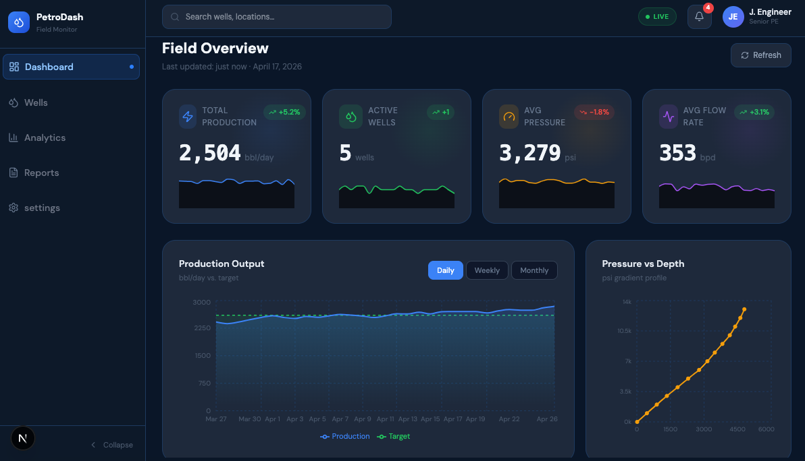
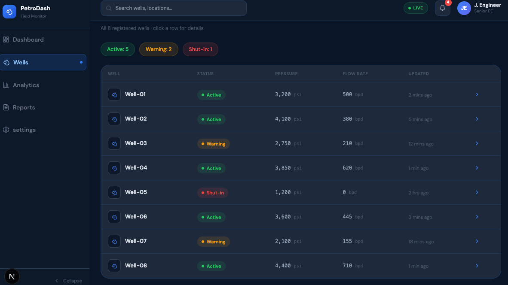
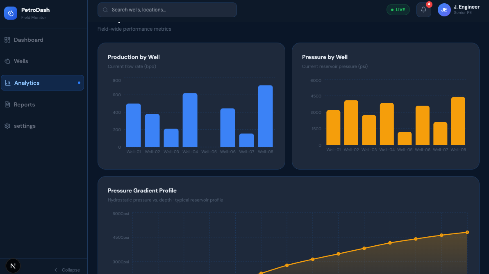
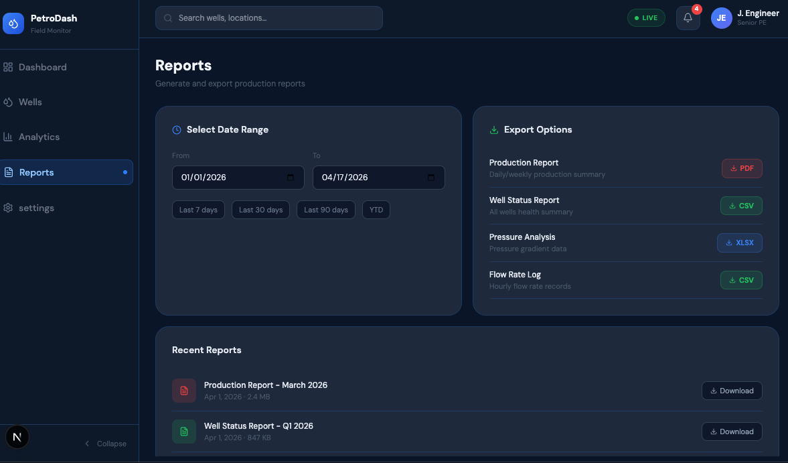
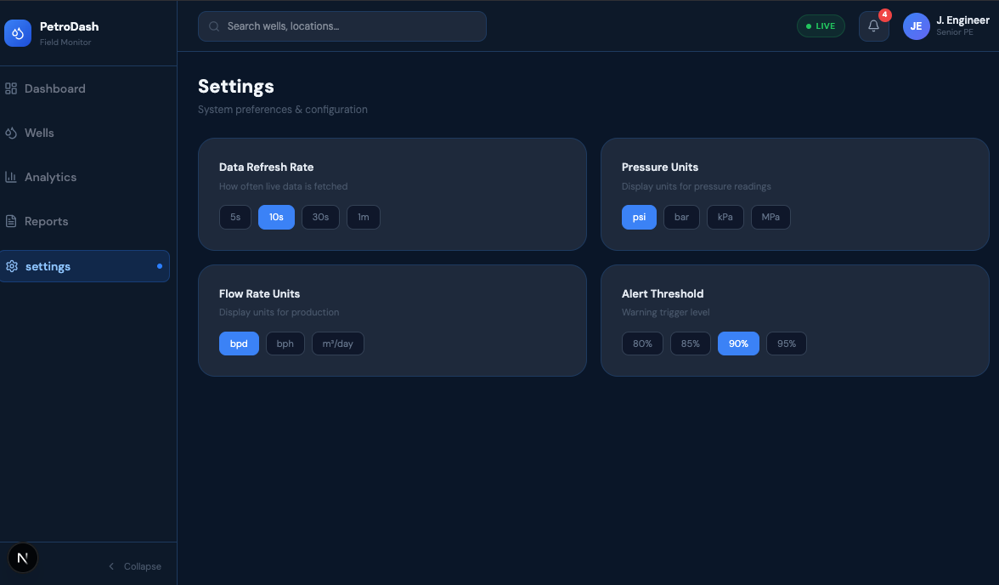

# 🛢️ PetroDash — Petroleum Field Monitoring Dashboard


> A production-grade petroleum engineering field monitoring dashboard built with React. Simulates real-time well data, pressure profiles, and production analytics — designed to look and feel like a real SCADA/field operations tool.

---

## 📸 Preview


---

## ✨ Features

### 🏠 Dashboard

- **4 Live Stat Cards** — Total Production, Active Wells, Avg Pressure, Avg Flow Rate
- **Sparklines** on every stat card with animated trend indicators
- **Production Chart** — Area chart with Daily / Weekly / Monthly toggle and target line overlay
- **Pressure vs. Depth Profile** — Hydrostatic gradient chart (reservoir engineering view)
- **Well Status Table** — Color-coded badges (🟢 Active / 🟡 Warning / 🔴 Shut-in)
- **Fake real-time updates** via `setInterval` (every 3 seconds)

### 🛢️ Wells Page

- Full well registry with status summary pills
- Clickable rows → opens slide-in **Well Details Panel**

### 🔍 Well Details Panel
- Well metadata: location, depth, type, status
- 48-hour **Pressure** time series chart
- 48-hour **Flow Rate** time series chart
- **Control panel** — Start / Stop toggle + adjustable flow rate slider

### 📊 Analytics

- Flow Rate by Well (bar chart)
- Pressure by Well (bar chart)
- Full pressure gradient profile (area chart)

### 📄 Reports

- Date range picker with quick-select presets (Last 7/30/90 days, YTD)
- Export buttons — PDF, CSV, XLSX (UI)
- Recent reports download list

### ⚙️ Settings

- Configurable: refresh rate, pressure units, flow rate units, alert threshold

### 🎨 UI/UX
- Dark engineering theme (`#0f172a` base)
- `Space Mono` monospace font for all numeric values
- `DM Sans` for UI text
- Loading skeletons on initial data fetch
- Collapsible sidebar
- Notification bell with dropdown
- Hover micro-interactions and glow effects

---

## 🗂️ Project Structure

```
MY-APP/
│
├── app/
│   ├── components/
│   │   └── ReUseables/
│   │       ├── pages/
│   │       │   └── dashboard/
│   │       │       ├── dashboard.tsx
│   │       │       ├── StatsCard.tsx
│   │       │       ├── Analytics.tsx
│   │       │       ├── reports.tsx
│   │       │       ├── settings.tsx
│   │       │       └── WellPage.tsx
│   │       │
│   │       ├── chartsRow.tsx
│   │       ├── chartToolTip.tsx
│   │       ├── ReUseable.tsx
│   │       ├── skeleton.tsx
│   │       ├── wellpanel.tsx
│   │       ├── wellrow.tsx
│   │       ├── logo.tsx
│   │       ├── navBar.tsx
│   │       └── navigation.tsx
│   │
│   ├── favicon.ico
│   ├── globals.css
│   ├── layout.tsx
│   └── page.tsx
│
├── public/
│
├── .gitignore
├── analytics.png
├── dashboard.png
├── eslint.config.mjs
├── next.config.ts
├── package-lock.json
├── package.json
├── postcss.config.mjs
├── README.md
├── reports.png
├── settings.png
├── tsconfig.json
└── wells.png
```

> **Note:** Currently implemented as a single-file React component. Refactoring into separate components is straightforward — see the [Component Breakdown](#-component-breakdown) section below.

---

## 🧩 Component Breakdown

The dashboard is architected around these logical components (currently co-located in `PetroDash.jsx`):

| Component          | Responsibility                                      |
|--------------------|-----------------------------------------------------| |
| `Navbar`           | Search bar, live indicator, notification bell, avatar |
| `StatCard`         | KPI card with sparkline, trend badge, and live value |
| `WellRow`          | Single row in the well status table                 |
| `WellDetailsPanel` | Slide-in panel with charts and well controls        |
| `ChartTooltip`     | Shared custom tooltip for all Recharts components   |
| `Skeleton`         | Loading placeholder shimmer                         |

---

## 🚀 Getting Started

### Prerequisites

- Node.js `v18+`
- npm or yarn

### Installation

```bash
# Clone the repository
git clone https://github.com/your-username/petrodash.git
cd petrodash

# Install dependencies
npm install
```

### Required Dependencies

```bash
npm install recharts lucide-react
```

### Run Development Server

```bash
npm run dev
# or
npm start
```

Open [http://localhost:3000](http://localhost:3000) to view it in the browser.

---

## 📦 Dependencies

| Package       | Version  | Purpose                            |
|---------------|----------|------------------------------------|
| `react`       | `^18.x`  | UI framework                       |
| `recharts`    | `^2.x`   | All charts (area, bar, line, scatter) |
| `lucide-react`| `latest` | Icon library                       |

---

## 🎨 Design System

### Color Palette

| Token       | Hex       | Usage                         |
|-------------|-----------|-------------------------------|
| Background  | `#0a1628` | App root background           |
| Surface      | `#0d1929` | Sidebar, navbar               |
| Card        | `#1e293b` | All cards and panels          |
| Border      | `#1e3a5f` | Card borders, table dividers  |
| Accent Blue | `#3b82f6` | Primary actions, active states|
| Success     | `#22c55e` | Active status, up trends      |
| Warning     | `#f59e0b` | Warning status, pressure chart|
| Danger      | `#ef4444` | Shut-in status, down trends   |
| Muted       | `#475569` | Labels, secondary text        |

### Typography

| Font         | Usage                              |
|--------------|------------------------------------|
| `DM Sans`    | All UI text, labels, navigation    |
| `Space Mono` | All numeric/metric values          |

---

## 📊 Data & Simulation

All data is **fake/simulated** — no backend required.

| Data Source           | Method                                      |
|-----------------------|---------------------------------------------|
| Well registry         | Static JSON array (8 wells)                |
| Stat card values      | Live — updated via `setInterval` every 3s  |
| Production chart      | Pre-generated with random walk algorithm   |
| Pressure vs. Depth    | Static hydrostatic gradient data           |
| Well time series      | Generated on mount using `useRef`          |

### Simulated Wells

| Well   | Type | Status  | Depth (ft) |
|--------|------|---------|------------|
| Well-01| Oil  | Active  | 12,400     |
| Well-02| Gas  | Active  | 10,800     |
| Well-03| Oil  | Warning | 9,600      |
| Well-04| Oil  | Active  | 14,200     |
| Well-05| Gas  | Shut-in | 11,100     |
| Well-06| Oil  | Active  | 13,300     |
| Well-07| Gas  | Warning | 8,900      |
| Well-08| Oil  | Active  | 15,600     |

---

## 🗺️ Roadmap

- [ ] Separate components into individual `.jsx` files
- [ ] Add React Router for proper page routing
- [ ] Connect to a real backend (Node.js / FastAPI)
- [ ] Add authentication (login page)
- [ ] Implement actual PDF/CSV export
- [ ] Add a map view (Leaflet or Mapbox) for well locations
- [ ] Unit tests with Jest + React Testing Library
- [ ] Dark/Light theme toggle

---

## 🧪 Petroleum Engineering Concepts Used

- **Reservoir Pressure (psi)** — Tracked per well, with gradient profile charts
- **Flow Rate (bpd)** — Barrels per day production metrics
- **Pressure vs. Depth Profile** — Hydrostatic pressure gradient (0.433 psi/ft approximation)
- **Well Status Classifications** — Active / Warning / Shut-in (standard field ops terminology)
- **Production Targets** — Target line overlaid on production time series

---

## 👨‍💻 Author

Built by **David Nwabuebo** · Petroleum Engineering + React

---

## 📄 License
NEXT_PUBLIC_WEATHER_KEY = 4d2f63c69d5a1b17a46f14c361211092
This project is licensed under the **MIT License** — see the [LICENSE](LICENSE) file for details.
